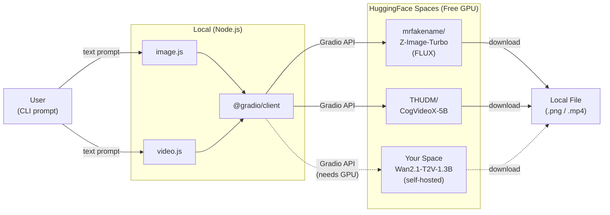
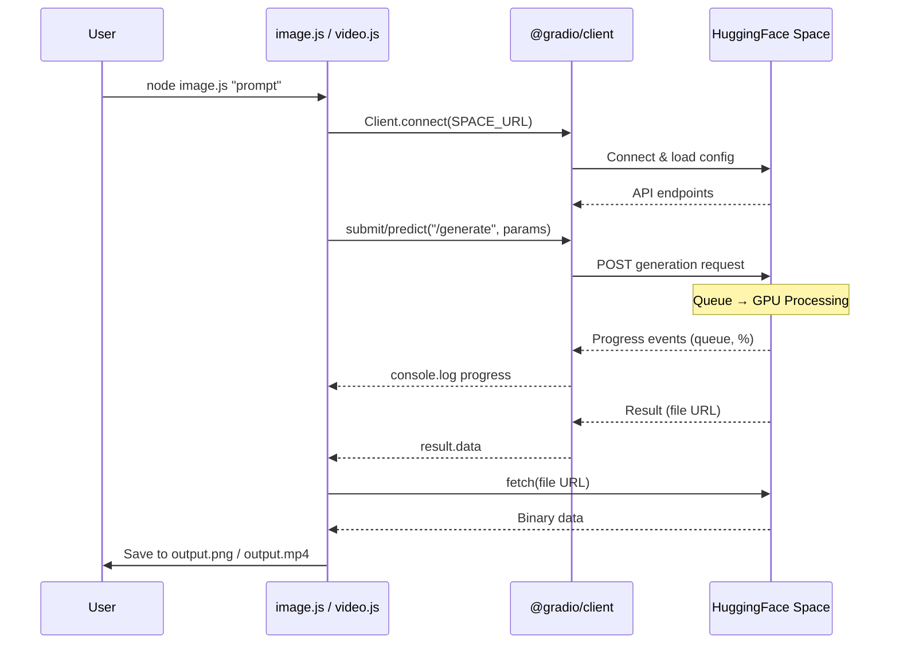

# AI Media Generator - Overview

CLI tools for generating AI images and videos using free HuggingFace Spaces.

## How It Works





The app connects to free, community-hosted AI model demos on HuggingFace Spaces via the Gradio API. No API keys needed for image generation. Video generation requires a HuggingFace Space with GPU.

## Files

| File | Purpose |
|------|---------|
| `image.js` | Text-to-image generation via [mrfakename/Z-Image-Turbo](https://huggingface.co/spaces/mrfakename/Z-Image-Turbo) |
| `video.js` | Text-to-video generation via [THUDM/CogVideoX-5B-Space](https://huggingface.co/spaces/THUDM/CogVideoX-5B-Space) |
| `space/app.py` | Custom HuggingFace Space app for self-hosted Wan2.1 video generation |
| `space/requirements.txt` | Python dependencies for the Space |

## Usage

### Image Generation
```bash
node image.js "A futuristic cityscape at night with neon lights"
```
- Uses: Z-Image-Turbo (FLUX-based)
- Output: PNG, 1024x1024
- Speed: ~5-10 seconds
- Free, no auth required

### Video Generation
```bash
node video.js "A cat walking on a beach at sunset"
```
- Uses: CogVideoX-5B
- Output: MP4, 720x480, ~6 seconds
- Speed: several minutes (queue dependent)
- Free, no auth required
- Supports progress logging (queue position, generation %)

## Self-Hosted Space (space/)

For more control, deploy `space/app.py` to your own HuggingFace Space:

- Model: Wan2.1-T2V-1.3B-Diffusers
- Requires: GPU hardware (ZeroGPU or paid)
- Exposes `/generate` API endpoint for use with `video.js`
- Configurable: resolution, frames, steps, guidance scale, seed

## Dependencies

- `@gradio/client` - Connects to HuggingFace Spaces Gradio API
- Node.js with ES modules (`"type": "module"` in package.json)
